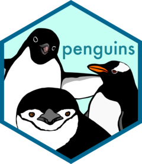

<!-- README.md is generated from README.Rmd. Please edit that file -->

```{r, include = FALSE}
knitr::opts_chunk$set(
  collapse = TRUE,
  comment = "#>",
  fig.path = "man/figures/README-",
  out.width = "75%",
  warning = FALSE,
  message = FALSE,
  fig.retina = 2,
  fig.align = 'center'
)
library(tidyverse)
library(palmerpenguins)
```

# palmerpenguins <a href='https://allisonhorst.github.io/palmerpenguins'></a>

<!-- badges: start -->

[](https://doi.org/10.5281/zenodo.3960218)
[](https://cran.r-project.org/package=palmerpenguins)

<!-- badges: end -->

The goal of palmerpenguins is to provide a great dataset for data exploration & visualization, as an alternative to `iris`. 

```{r flipper-bill, echo=FALSE}
flipper_bill <- ggplot(data = penguins,
                         aes(x = flipper_length_mm,
                             y = bill_length_mm)) +
  geom_point(aes(color = species, 
                 shape = species),
             size = 3,
             alpha = 0.8) +
  geom_smooth(method = "lm", se = FALSE, aes(color = species)) +
  theme_minimal() +
  scale_color_manual(values = c("darkorange","purple","cyan4")) +
  labs(title = "Flipper and bill length",
       subtitle = "Dimensions for Adelie, Chinstrap and Gentoo Penguins at Palmer Station LTER",
       x = "Flipper length (mm)",
       y = "Bill length (mm)",
       color = "Penguin species",
       shape = "Penguin species") +
  theme(legend.position = c(0.85, 0.15),
        legend.background = element_rect(fill = "white", color = NA),
        plot.title.position = "plot",
        plot.caption = element_text(hjust = 0, face= "italic"),
        plot.caption.position = "plot")

flipper_bill
```


## Installation

You can install the released version of palmerpenguins from [CRAN](https://CRAN.R-project.org) with:

``` r
install.packages("palmerpenguins")
```

To install the development version from [GitHub](https://github.com/) use:

``` r
# install.packages("remotes")
remotes::install_github("allisonhorst/palmerpenguins")
```

## About the data

Data were collected and made available by [Dr. Kristen Gorman](https://www.uaf.edu/cfos/people/faculty/detail/kristen-gorman.php) and the [Palmer Station, Antarctica LTER](https://pal.lternet.edu/), a member of the [Long Term Ecological Research Network](https://lternet.edu/). 

The palmerpenguins package contains two datasets. 

```{r showdata}
library(palmerpenguins)
data(package = 'palmerpenguins')
``` 

One is called `penguins`, and is a simplified version of the raw data; see `?penguins` for more info: 

```{r example-penguins}
head(penguins)
```


The second dataset is `penguins_raw`, and contains all the variables and original names as downloaded; see `?penguins_raw` for more info.

```{r example-penguins-raw}
head(penguins_raw)
```

Both datasets contain data for `r nrow(penguins)` penguins. There are `r length(unique(penguins$species))` different species of penguins in this dataset, collected from `r length(unique(penguins$island))` islands in the Palmer Archipelago, Antarctica. 

```{r}
str(penguins)
```


We gratefully acknowledge Palmer Station LTER and the US LTER Network. Special thanks to Marty Downs (Director, LTER Network Office) for help regarding the data license & use. 


## Examples

You can find these and more code examples for exploring palmerpenguins in `vignette("examples")`.

Penguins are fun to summarize! For example:

```{r example, warning=FALSE, message=FALSE}
library(tidyverse)
penguins %>% 
  count(species)
penguins %>% 
  group_by(species) %>% 
  summarize(across(where(is.numeric), mean, na.rm = TRUE))
```

Penguins are fun to visualize! For example:

```{r mass-flipper, warning = FALSE, message = FALSE, echo = FALSE, out.width='75%', fig.retina=2}
mass_flipper <- ggplot(data = penguins, 
                       aes(x = flipper_length_mm,
                           y = body_mass_g)) +
  geom_point(aes(color = species, 
                 shape = species),
             size = 3,
             alpha = 0.8) +
  theme_minimal() +
  scale_color_manual(values = c("darkorange","purple","cyan4")) +
  labs(title = "Penguin size, Palmer Station LTER",
       subtitle = "Flipper length and body mass for Adelie, Chinstrap, and Gentoo Penguins",
       x = "Flipper length (mm)",
       y = "Body mass (g)",
       color = "Penguin species",
       shape = "Penguin species") +
  theme(legend.position = c(0.2, 0.7),
        legend.background = element_rect(fill = "white", color = NA),
        plot.title.position = "plot",
        plot.caption = element_text(hjust = 0, face= "italic"),
        plot.caption.position = "plot")

mass_flipper
```

```{r flipper-hist, echo=FALSE}
flipper_hist <- ggplot(data = penguins, aes(x = flipper_length_mm)) +
  geom_histogram(aes(fill = species), 
                 alpha = 0.5, 
                 position = "identity") +
  scale_fill_manual(values = c("darkorange","purple","cyan4")) +
  theme_minimal() +
  labs(x = "Flipper length (mm)",
       y = "Frequency",
       title = "Penguin flipper lengths")

flipper_hist
```

## Artwork

You can download palmerpenguins art (useful for teaching with the data) in `vignette("art")`. If you use this artwork, please cite with: "Artwork by @allison_horst".

### Meet the Palmer penguins

```{r, echo = FALSE, fig.align='center'}
knitr::include_graphics("man/figures/lter_penguins.png", dpi = 300)
```

### Bill dimensions

The culmen is the upper ridge of a bird's bill. In the simplified `penguins` data, culmen length and depth are renamed as variables `bill_length_mm` and `bill_depth_mm` to be more intuitive.  

For this penguin data, the culmen (bill) length and depth are measured as shown below (thanks Kristen Gorman for clarifying!):

```{r, echo = FALSE, fig.align='center'}
knitr::include_graphics("man/figures/culmen_depth.png", dpi = 300)
```

## License

Data are available by  [CC-0](https://creativecommons.org/share-your-work/public-domain/cc0/) license in accordance with the [Palmer Station LTER Data Policy](http://pal.lternet.edu/data/policies) and the [LTER Data Access Policy for Type I data](https://lternet.edu/data-access-policy/).

## Citation

To cite the palmerpenguins package, please use:

```{r}
citation("palmerpenguins")
```


## Additional data use information

Anyone interested in publishing the data should contact [Dr. Kristen Gorman](https://www.uaf.edu/cfos/people/faculty/detail/kristen-gorman.php) about analysis and working together on any final products. From Gorman et al. (2014): "Individuals interested in using these data are expected to follow the US LTER Network’s Data Access Policy, Requirements and Use Agreement: https://lternet.edu/data-access-policy/."

## References

**Data originally published in:** 

+ Gorman KB, Williams TD, Fraser WR (2014). Ecological sexual dimorphism and environmental variability within a community of Antarctic penguins (genus *Pygoscelis*). PLoS ONE 9(3):e90081.  https://doi.org/10.1371/journal.pone.0090081


**Data citations:**

Adélie penguins: 

+ Palmer Station Antarctica LTER and K. Gorman, 2020. Structural size measurements and isotopic signatures of foraging among adult male and female Adélie penguins (*Pygoscelis adeliae*) nesting along the Palmer Archipelago near Palmer Station, 2007-2009 ver 5. Environmental Data Initiative. https://doi.org/10.6073/pasta/98b16d7d563f265cb52372c8ca99e60f (Accessed 2020-06-08).

Gentoo penguins:

+ Palmer Station Antarctica LTER and K. Gorman, 2020. Structural size measurements and isotopic signatures of foraging among adult male and female Gentoo penguin (*Pygoscelis papua*) nesting along the Palmer Archipelago near Palmer Station, 2007-2009 ver 5. Environmental Data Initiative. https://doi.org/10.6073/pasta/7fca67fb28d56ee2ffa3d9370ebda689 (Accessed 2020-06-08).

Chinstrap penguins: 

+ Palmer Station Antarctica LTER and K. Gorman, 2020. Structural size measurements and isotopic signatures of foraging among adult male and female Chinstrap penguin (*Pygoscelis antarcticus*) nesting along the Palmer Archipelago near Palmer Station, 2007-2009 ver 6. Environmental Data Initiative. https://doi.org/10.6073/pasta/c14dfcfada8ea13a17536e73eb6fbe9e (Accessed 2020-06-08).
