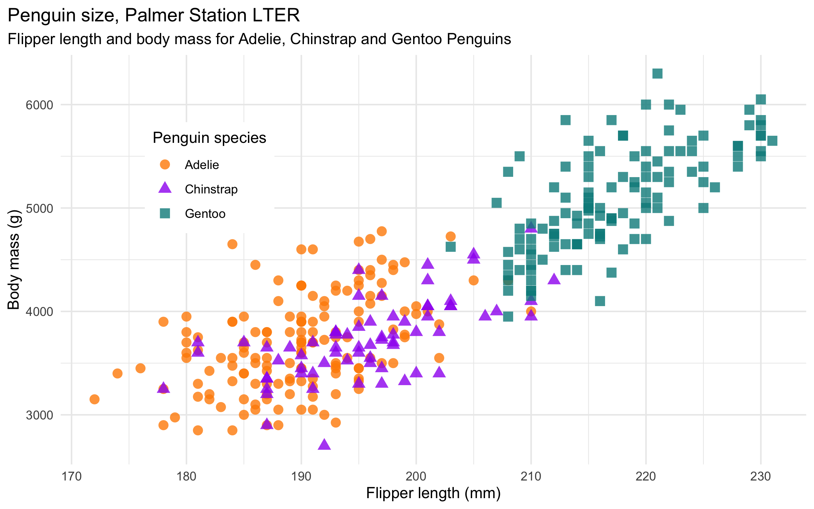

# Palmer Station LTER Penguins

Data are generously collected and made available by [Dr. Kristen Gorman](https://www.uaf.edu/cfos/people/faculty/detail/kristen-gorman.php) and the [Palmer Station, Antarctica LTER](https://pal.lternet.edu/), a member of the [Long Term Ecological Research Network](https://lternet.edu/). 

Thank you Dr. Gorman, Palmer Station LTER and the LTER Network! See full citation and data information below. 

## Summary:

Data for 3 penguin species (Chinstrap, Adelie, & Gentoo) have been combined into a single CSV, **penguins_lter.csv**. A simplified subset **penguins_size.csv** is also included, which contains four penguin size measurements (culmen length, culmen depth, flipper length, and body mass) for the 3 species, along with island and sex. 

Here is an example graph using the data:

# Data: 

Data are from: 

**Gorman KB, Williams TD, Fraser WR** (2014) Ecological Sexual Dimorphism and Environmental Variability within a Community of Antarctic Penguins (Genus *Pygoscelis*). PLoS ONE 9(3): e90081. doi:10.1371/journal.pone.0090081

See the full paper [HERE](https://journals.plos.org/plosone/article?id=10.1371/journal.pone.0090081). 

## Original data access and use: 

From Gorman et al.: "Data reported here are publicly available within the PAL-LTER data system (datasets #219, 220, and 221): http://oceaninformatics.ucsd.edu/datazoo/data/pallter/datasets. These data are additionally archived within the United States (US) LTER Network’s Information System Data Portal: https://portal.lternet.edu/. Individuals interested in using these data are therefore expected to follow the US LTER Network’s Data Access Policy, Requirements and Use Agreement: https://lternet.edu/data-access-policy/."

Anyone interested in publishing the data should contact [Dr. Kristen Gorman](https://www.uaf.edu/cfos/people/faculty/detail/kristen-gorman.php) about analysis and working together on any final products.

**Links to original data from LTER Network Data Portal:** 

Data accessed via the [LTER Data Portal](https://portal.lternet.edu/nis/home.jsp): 

- Chinstrap penguins: https://portal.lternet.edu/nis/mapbrowse?packageid=knb-lter-pal.220.3
- Adelie penguins: https://portal.lternet.edu/nis/mapbrowse?packageid=knb-lter-pal.219.3
- Gentoo penguins: https://portal.lternet.edu/nis/mapbrowse?packageid=knb-lter-pal.221.2

**Data citations:** 

- Gorman K. 2017. Structural size measurements and isotopic signatures of foraging among adult male and female chinstrap penguins (Pygoscelis antarctica) nesting along the Palmer Archipelago near Palmer Station, 2007-2009. Environmental Data Initiative. https://doi.org/10.6073/pasta/2b1cff60f81640f182433d23e68541ce. 

- Gorman K. 2017. Structural size measurements and isotopic signatures of foraging among adult male and female Adélie penguins (Pygoscelis adeliae) nesting along the Palmer Archipelago near Palmer Station, 2007-2009. Environmental Data Initiative. https://doi.org/10.6073/pasta/abc50eed9138b75f54eaada0841b9b86.

- Gorman K. 2017. Structural size measurements and isotopic signatures of foraging among adult male and female gentoo penguins (Pygoscelis papua) nesting along the Palmer Archipelago near Palmer Station, 2007-2009. Environmental Data Initiative. https://doi.org/10.6073/pasta/409c808f8fc9899d02401bdb04580af7.

