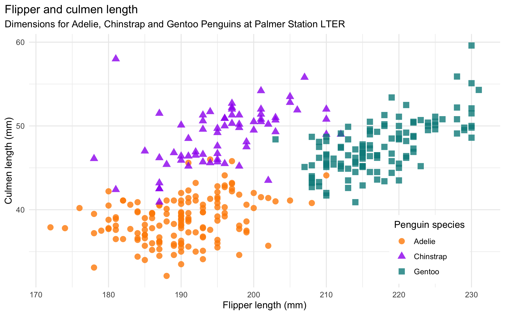
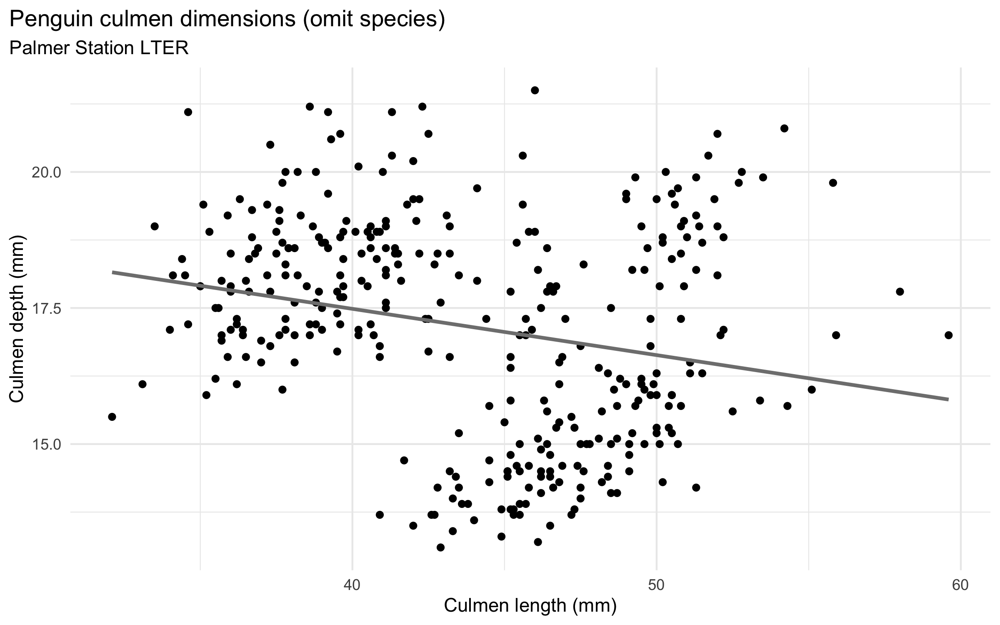
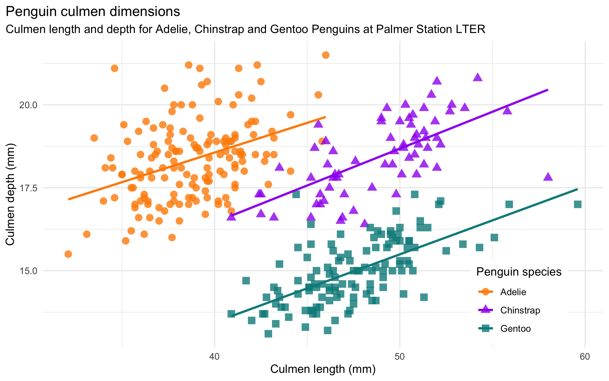
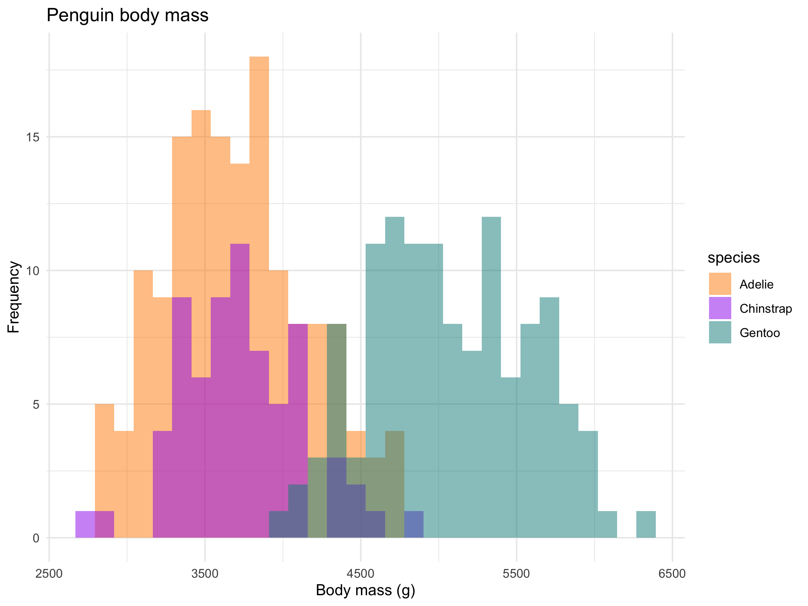
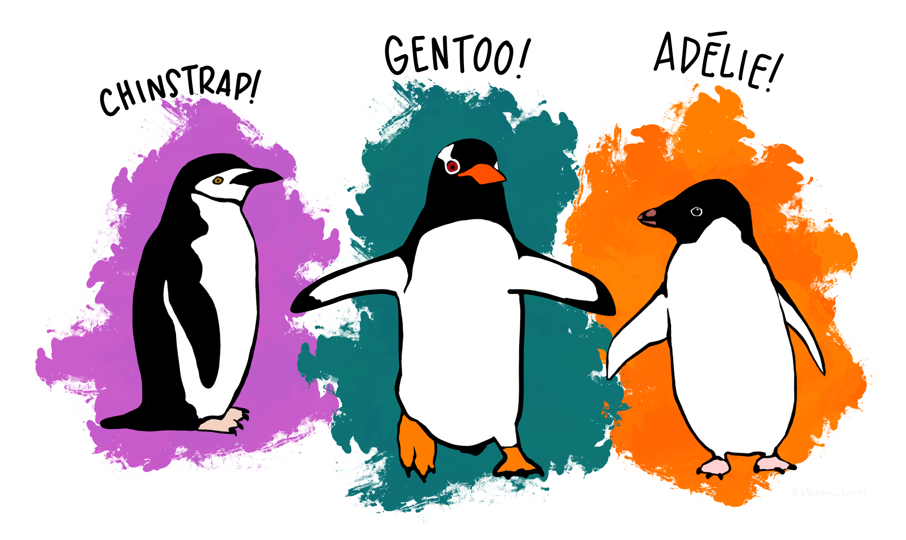

# Palmer Archipelago (Antarctica) Penguins data package (`penguins`)

## Installation 

Or install the development version from GitHub with:

```
# install.packages("devtools")
devtools::install_github("allisonhorst/penguins")
```

See `?penguins` for information on the simplified subset, and `?penguins_raw` for information on the raw data. 

## About the data

Data were collected and made available by [Dr. Kristen Gorman](https://www.uaf.edu/cfos/people/faculty/detail/kristen-gorman.php) and the [Palmer Station, Antarctica LTER](https://pal.lternet.edu/), a member of the [Long Term Ecological Research Network](https://lternet.edu/). 

**Thank you** to Dr. Gorman, Palmer Station LTER and the LTER Network! Special thanks to Marty Downs (Director, LTER Network Office) for help regarding the data license & use.

### License & citation

- **Data are available by** [CC-0](https://creativecommons.org/share-your-work/public-domain/cc0/) license in accordance with the [Palmer Station LTER Data Policy](http://pal.lternet.edu/data/policies) and the [LTER Data Access Policy for Type I data](https://lternet.edu/data-access-policy/).

- **Please cite data using the following:**

    - **Adélie penguins:** Palmer Station Antarctica LTER and K. Gorman. 2020. Structural size measurements and isotopic signatures of foraging among adult male and female Adélie penguins (*Pygoscelis adeliae*) nesting along the Palmer Archipelago near Palmer Station, 2007-2009 ver 5. Environmental Data Initiative. https://doi.org/10.6073/pasta/98b16d7d563f265cb52372c8ca99e60f (Accessed 2020-06-08).

    - **Gentoo penguins:** Palmer Station Antarctica LTER and K. Gorman. 2020. Structural size measurements and isotopic signatures of foraging among adult male and female Gentoo penguin (*Pygoscelis papua*) nesting along the Palmer Archipelago near Palmer Station, 2007-2009 ver 5. Environmental Data Initiative. https://doi.org/10.6073/pasta/7fca67fb28d56ee2ffa3d9370ebda689 (Accessed 2020-06-08).

    - **Chinstrap penguins:** Palmer Station Antarctica LTER and K. Gorman. 2020. Structural size measurements and isotopic signatures of foraging among adult male and female Chinstrap penguin (*Pygoscelis antarcticus*) nesting along the Palmer Archipelago near Palmer Station, 2007-2009 ver 6. Environmental Data Initiative. https://doi.org/10.6073/pasta/c14dfcfada8ea13a17536e73eb6fbe9e (Accessed 2020-06-08).

    - **Originally published in:** [**Gorman KB, Williams TD, Fraser WR** (2014) Ecological Sexual Dimorphism and Environmental Variability within a Community of Antarctic Penguins (Genus *Pygoscelis*). PLoS ONE 9(3): e90081. doi:10.1371/journal.pone.0090081](https://journals.plos.org/plosone/article?id=10.1371/journal.pone.0090081)


### Get data directly from the Environmental Data Initiative: 

Get the data directly from EDI using the R code below. Thanks to [Julien Brun](http://brunj7.github.io/about/ ) for the reminder and code below to access & combine them (this will get you the same data as in penguins_lter.csv):  

```
# Adelie penguin data from: https://doi.org/10.6073/pasta/abc50eed9138b75f54eaada0841b9b86

uri_adelie <- "https://portal.edirepository.org/nis/dataviewer?packageid=knb-lter-pal.219.3&entityid=002f3893385f710df69eeebe893144ff"

# Gentoo penguin data from: https://doi.org/10.6073/pasta/2b1cff60f81640f182433d23e68541ce

uri_gentoo <- "https://portal.edirepository.org/nis/dataviewer?packageid=knb-lter-pal.220.3&entityid=e03b43c924f226486f2f0ab6709d2381"

# Chinstrap penguin data from: https://doi.org/10.6073/pasta/409c808f8fc9899d02401bdb04580af7
uri_chinstrap <- "https://portal.edirepository.org/nis/dataviewer?packageid=knb-lter-pal.221.2&entityid=fe853aa8f7a59aa84cdd3197619ef462"

# Combining the URIs
uris <- c(uri_adelie, uri_gentoo, uri_chinstrap)

# Downloading and importing data
penguins_lter <- map_dfr(uris, read_csv)
```


## Example graphs using the data:

#### Flipper length vs. body mass


#### Flipper length vs. culmen length



#### Simpson's paradox example

Culmen length vs. culmen depth, omitting species: 



Culmen length vs. culmen depth, including species: 



#### Opportunities for comparisons between groups

There are a number of questions you could ask about differences between groups. Here are a couple histograms to consider.

Flipper length histograms:


Body mass histograms: 



## Supplemental artwork

You are invited to use this accompanying artwork (Artwork: @allison_horst):

#### Meet the penguins: 


#### What are culmen length & depth? 

The culmen is "the upper ridge of a bird's beak" (definition from Oxford Languages). 

For this penguin data, the culmen length and culmen depth are measured as shown below (thanks Kristen Gorman for clarifying!):


## Additional data use information: 

Anyone interested in publishing the data should contact [Dr. Kristen Gorman](https://www.uaf.edu/cfos/people/faculty/detail/kristen-gorman.php) about analysis and working together on any final products.

From Gorman et al. (2014): "Data reported here are publicly available within the PAL-LTER data system (datasets #219, 220, and 221): http://oceaninformatics.ucsd.edu/datazoo/data/pallter/datasets. These data are additionally archived within the United States (US) LTER Network’s Information System Data Portal: https://portal.lternet.edu/. Individuals interested in using these data are therefore expected to follow the US LTER Network’s Data Access Policy, Requirements and Use Agreement: https://lternet.edu/data-access-policy/."

From the LTER data access policy: "The consumer of these data (“Data User” herein) has an ethical obligation to cite it appropriately in any publication that results from its use. The Data User should realize that these data may be actively used by others for ongoing research and that coordination may be necessary to prevent duplicate publication. The Data User is urged to contact the authors of these data if any questions about methodology or results occur. Where appropriate, the Data User is encouraged to consider collaboration or coauthorship with the authors. The Data User should realize that misinterpretation of data may occur if used out of context of the original study. While substantial efforts are made to ensure the accuracy of data and associated documentation, complete accuracy of data sets cannot be guaranteed. All data are made available “as is.” The Data User should be aware, however, that data are updated periodically and it is the responsibility of the Data User to check for new versions of the data. The data authors and the repository where these data were obtained shall not be liable for damages resulting from any use or misinterpretation of the data. Thank you."
