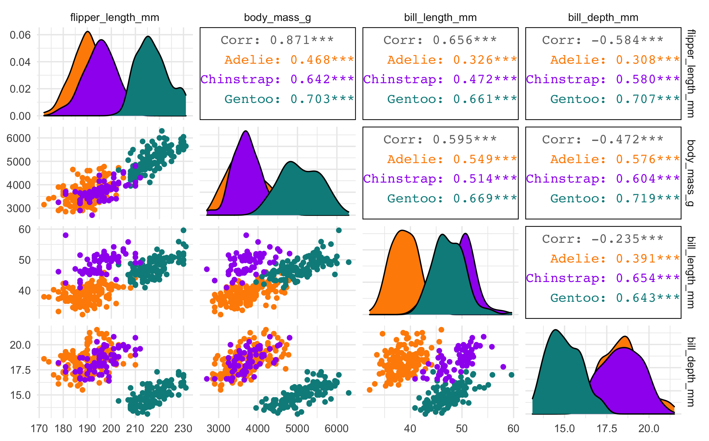

```{r, include = FALSE}
knitr::opts_chunk$set(
  comment = "#>",
  warning = FALSE,
  message = FALSE,
  eval = FALSE,
  out.width = "100%"
)
library(palmerpenguins)
library(recipes)
library(tidyr)
library(dplyr)
library(ggplot2)
theme_set(theme_minimal())
```

You'll need these packages to follow along with the code in this article locally:

```{r setup, message=FALSE, warning=FALSE}
library(palmerpenguins)
library(corrr)
library(GGally)
library(recipes)
library(tidytext)
library(dplyr)
library(tidyr)
library(ggplot2)
theme_set(theme_minimal())
```

## Correlation matrix

The `palmerpenguins::penguins` data contains several size measurement variables that are correlated. Let's take a look at the correlation matrix with the [corrr package](https://corrr.tidymodels.org/) and the `corrr::correlate()` function:

```{r corrr}
library(corrr)
penguins_corr <- penguins %>%
  dplyr::select(body_mass_g, ends_with("_mm")) %>%
  correlate() %>%
  rearrange()
penguins_corr
```
```
#> # A tibble: 4 x 5
#>   rowname           flipper_length_mm body_mass_g bill_length_mm bill_depth_mm
#>   <chr>                         <dbl>       <dbl>          <dbl>         <dbl>
#> 1 flipper_length_mm            NA           0.871          0.656        -0.584
#> 2 body_mass_g                   0.871      NA              0.595        -0.472
#> 3 bill_length_mm                0.656       0.595         NA            -0.235
#> 4 bill_depth_mm                -0.584      -0.472         -0.235        NA  
```


Body mass and flipper length appear highly correlated, but neither of the bill variables appears to be as highly correlated with any other variables.

## Pairwise plot matrix

We can visualize these correlations with the [GGally package](https://ggobi.github.io/ggally/). The function we'll use is called [`GGally::ggpairs()`](https://ggobi.github.io/ggally/articles/ggpairs.html).

```{r penguin-pairs}
penguins %>%
  select(species, body_mass_g, ends_with("_mm")) %>% 
  GGally::ggpairs(aes(color = species),
          columns = c("flipper_length_mm", "body_mass_g", 
                      "bill_length_mm", "bill_depth_mm")) +
  scale_colour_manual(values = c("darkorange","purple","cyan4")) +
  scale_fill_manual(values = c("darkorange","purple","cyan4"))
```

```{r include=FALSE}
ggsave("vignettes/articles/figs/penguin-pairs.png", width = 8)
```

```{r eval=TRUE, echo=FALSE}

```

## Principal component analysis (PCA)

We'll use the [recipes](https://recipes.tidymodels.org) package from [tidymodels](https://www.tidymodels.org) to perform a [principal component analysis (PCA)](https://en.wikipedia.org/wiki/Principal_component_analysis). 

First, we'll also use a few recipe steps to preprocess the data for PCA; namely, we need to:

+ remove any `NA` values,
+ center all predictors, and 
+ scale all predictors. 

If you've never used the recipes package before, try [this article](https://www.tidymodels.org/start/recipes/) to get started.

```{r penguin-recipe, eval=TRUE}
library(recipes)
penguin_recipe <-
  recipe(~., data = penguins) %>% 
  update_role(species, island, sex, year, new_role = "id") %>% 
  step_naomit(all_predictors()) %>% 
  step_normalize(all_predictors()) %>%
  step_pca(all_predictors(), id = "pca") %>% 
  prep()

penguin_pca <- 
  penguin_recipe %>% 
  tidy(id = "pca") 

penguin_pca
```


The `value` column here is the loading. For each component, the `value` tells us the linear combination of weights for each variable that contributes to that component. 


This output is a tidy version of this using `stats::prcomp()`:

```{r prcomp, eval=TRUE}
penguins %>% 
  dplyr::select(body_mass_g, ends_with("_mm")) %>% 
  tidyr::drop_na() %>% 
  scale() %>% 
  prcomp() %>%  
  .$rotation
```


We can also apply the `recipes::tidy()` method to the output from `recipes::step_pca()` to examine how much variance each component accounts for:

```{r eval=TRUE}
penguin_recipe %>% 
  tidy(id = "pca", type = "variance") %>% 
  dplyr::filter(terms == "percent variance") %>% 
  ggplot(aes(x = component, y = value)) + 
  geom_col(fill = "#b6dfe2") + 
  xlim(c(0, 5)) + 
  ylab("% of total variance")
```


## Plot PCA loadings

We can plot these loadings by principal component too, following [Julia Silge's example](https://juliasilge.com/blog/cocktail-recipes-umap/):

```{r pca-loadings-plot}
library(ggplot2)
penguin_pca %>%
  mutate(terms = tidytext::reorder_within(terms, 
                                          abs(value), 
                                          component)) %>%
  ggplot(aes(abs(value), terms, fill = value > 0)) +
  geom_col() +
  facet_wrap(~component, scales = "free_y") +
  tidytext::scale_y_reordered() +
  scale_fill_manual(values = c("#b6dfe2", "#0A537D")) +
  labs(
    x = "Absolute value of contribution",
    y = NULL, fill = "Positive?"
  ) 
```

```{r include=FALSE}
ggsave("vignettes/articles/figs/pca-loadings-plot.png", width = 8)
```

```{r eval=TRUE, echo=FALSE}
knitr::include_graphics("figs/pca-loadings-plot.png")
```


## Plot PCA loadings + scores

We have the PCA loadings in `penguin_pca`. But we need them in a wide format now for plotting.

```{r widen-penguins, eval=TRUE}
# get pca loadings into wider format
pca_wider <- penguin_pca %>% 
  tidyr::pivot_wider(names_from = component, id_cols = terms)
```

We also need to go back to our prepped penguin recipe, `prepped_penguins`, and `recipes::juice()` it to get the PCA scores back.

```{r pc1-2-plot, eval=TRUE}
# define arrow style
arrow_style <- arrow(length = unit(.05, "inches"),
                     type = "closed")


pca_plot <-
  juice(penguin_recipe) %>%
  ggplot(aes(PC1, PC2)) +
  geom_point(aes(color = species, shape = species), 
             alpha = 0.8, 
             size = 2) +
  scale_colour_manual(values = c("darkorange","purple","cyan4")) 

pca_plot +
  geom_segment(data = pca_wider,
               aes(xend = PC1, yend = PC2), 
               x = 0, 
               y = 0, 
               arrow = arrow_style) + 
  geom_text(data = pca_wider,
            aes(x = PC1, y = PC2, label = terms), 
            hjust = 0, 
            vjust = 1,
            size = 5, 
            color = '#0A537D') 
```


In the above plot, you can see a lot! 

First, if you focus on the x-axis showing us the first principal component, you can see that flipper length and body mass are very important (confirming what we saw in the above bar chart). Along this dimension, Gentoo penguins stand out clearly from the other two species. We can confirm this looking at summary statistics:

```{r eval=TRUE}
penguins %>% 
  group_by(species) %>% 
  summarize(across(c(flipper_length_mm, body_mass_g), 
                   mean, 
                   na.rm = TRUE)) 
```

We can see this with a simple scatterplot:

```{r flipper-mass-plot, eval=TRUE}
ggplot(penguins, aes(x = flipper_length_mm, y = body_mass_g, colour = species)) +
  geom_point() +
  scale_colour_manual(values = c("darkorange","purple","cyan4")) 
```


If you now focus more on the y-axis showing us the second principal component, you can see that our two bill size variables, `bill_length_mm` and `bill_depth_mm`, are very important (again, confirming what we saw in the above bar chart).

Let's do the same thing for principal component 2 and 3. 

```{r eval=TRUE}
pca_plot %+% 
  aes(PC2, PC3) +
  geom_segment(data = pca_wider,
               aes(xend = PC2, yend = PC3), 
               x = 0, 
               y = 0, 
               arrow = arrow_style) + 
  geom_text(data = pca_wider,
            aes(x = PC2, y = PC3, label = terms), 
            hjust = 0, 
            vjust = 1,
            size = 5, 
            color = '#0A537D') 
```

We see again that PC2 seems most associated with our bill size variables, `bill_length_mm` and `bill_depth_mm`. But now we can see more clearly that this dimension seems to separate Chinstrap penguins from the other two species. We can confirm this by glancing at summary statistics again by species:

```{r eval=TRUE}
penguins %>% 
  group_by(species) %>% 
  summarize(across(c(bill_depth_mm, bill_length_mm), 
                   mean, 
                   na.rm = TRUE))
```

We can see this with a simple scatterplot too:

```{r eval=TRUE}
ggplot(penguins, aes(x = bill_length_mm, y = bill_depth_mm, colour = species)) +
  geom_point() +
  scale_colour_manual(values = c("darkorange","purple","cyan4")) 
```


This is actually a pretty neat scatterplot---it highlights a perfect example of why you'd need the combination of two variables to differentiate between these three species. Comparing distributions for any single variable only differentiates one species from the other two!^[this is also a great example Simpson's paradox, see `vignette("examples")`]

```{r eval=TRUE, fig.show="hold", out.width="49%", echo=FALSE}
ggplot(data = penguins, aes(x = bill_length_mm)) +
  geom_histogram(aes(fill = species), alpha = 0.5, position = "identity") +
  scale_fill_manual(values = c("darkorange","darkorchid","cyan4"))

ggplot(data = penguins, aes(x = bill_depth_mm)) +
  geom_histogram(aes(fill = species), alpha = 0.5, position = "identity") +
  scale_fill_manual(values = c("darkorange","darkorchid","cyan4"))
```

## Summary

So, Gentoos appear to just be giants, compared to the Adelie and Chinstrap penguins. While Adelie and Chinstraps are similar size-wise as measured by flipper length and body mass, Chinstraps seem to have longer bills and Adelie penguins have stubbier bills (a pug-gein, if you will?). And Gentoos, despite being large overall, have flatter bills than either of the other two species. Reminder:


## Other PCA resources

+ Michael Friendly's [multivariate palmerpenguins analysis](https://rpubs.com/friendly/penguin-biplots)
+ Julia Silge's [PCA and UMAP with tidymodels and #TidyTuesday cocktail recipes](https://juliasilge.com/blog/cocktail-recipes-umap/)
